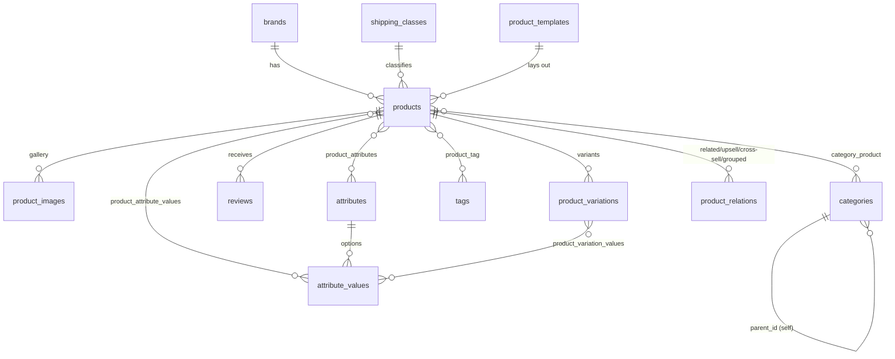
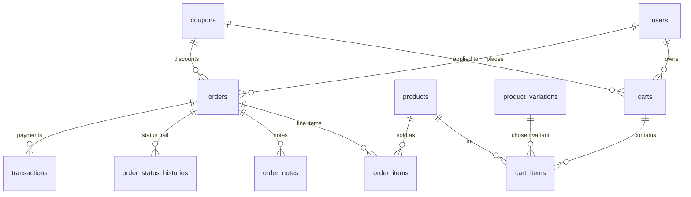
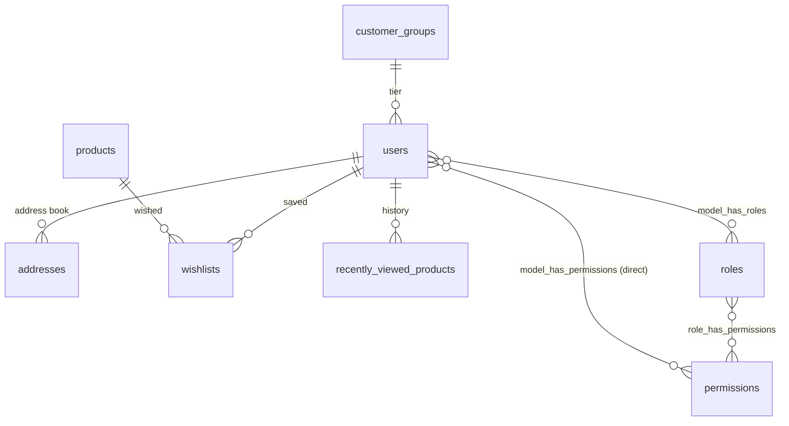
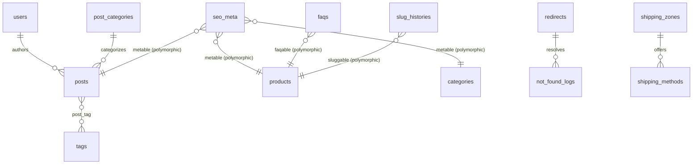
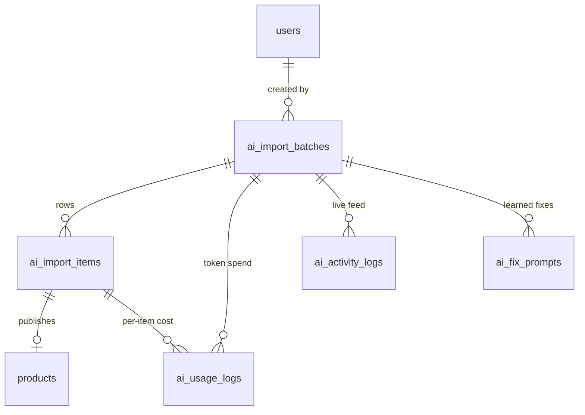

# ShopKit — Database Guide

> Complete reference to the ShopKit database so any developer can understand the schema, how the
> tables relate, and where each domain lives. Generated from the **live MySQL schema** (accurate to
> the current migrations), then annotated by hand. Pairs with [PROJECT.md](../PROJECT.md) (app
> architecture) and [docs/AI-PUBLISHER.md](AI-PUBLISHER.md) (AI agent).
>
> **Engine:** MySQL 9.x · InnoDB · utf8mb4. **80 tables** total (69 domain tables documented below +
> 11 Laravel framework tables: `cache`, `cache_locks`, `jobs`, `job_batches`, `failed_jobs`,
> `sessions`, `password_reset_tokens`, `migrations`, and the three Spatie pivots).
>
> **How to regenerate:** the column reference in §4 is produced from
> `information_schema` — see the snippet at the end of this file to rebuild it after a migration.

---

## 1. Reading this document

- **§2 Domain map** — every table grouped by the part of the app it serves.
- **§3 ER diagrams** — Mermaid entity-relationship diagrams per domain (they render as diagrams on
  GitHub, GitLab, VS Code, and most Markdown viewers).
- **§4 Table reference** — every column of every domain table: type, nullability, key, and foreign
  key target.

Legend for the key column in §4: **PK** = primary key · **UQ** = unique · **IX** = indexed
(includes foreign keys) · **FK →** = the column references that `table.column`.

Conventions used throughout the schema:
- Every domain table has `id` (bigint PK) and `created_at`/`updated_at` timestamps unless noted.
- Money is `decimal(10,2)`; percentages `decimal(5,2)`; weights `decimal(8,3)`.
- Flexible/nested data is stored as `json` (casts to array on the model).
- Booleans are `tinyint(1)`. Two-letter country codes are `char(2)`/`varchar(2)`.
- Soft deletes (`deleted_at`) appear on `products`, `posts`, `pages`.
- Polymorphic relations use `{name}_id` + `{name}_type` pairs (e.g. `metable_id`/`metable_type`).

---

## 2. Domain map

| Domain | Tables |
|---|---|
| **Catalog** | `products`, `brands`, `categories`, `category_product`, `product_images`, `product_variations`, `product_variation_values`, `attributes`, `attribute_values`, `product_attributes`, `product_attribute_values`, `tags`, `product_tag`, `product_relations`, `shipping_classes`, `reviews`, `product_templates` |
| **Cart & Orders** | `carts`, `cart_items`, `orders`, `order_items`, `order_notes`, `order_status_histories`, `transactions` |
| **Coupons** | `coupons`, `coupon_products`, `coupon_categories`, `coupon_users`, `coupon_usages` |
| **Customers** | `users`, `addresses`, `wishlists`, `customer_groups`, `recently_viewed_products`, `subscribers` |
| **Shipping & Tax & Payment** | `shipping_zones`, `shipping_methods`, `shipping_classes`, `tax_rates`, `payment_rules` |
| **CMS / Content** | `pages`, `posts`, `post_categories`, `post_tag`, `content_blocks`, `homepage_sections`, `faqs`, `media` |
| **SEO** | `seo_meta`, `redirects`, `not_found_logs`, `slug_histories`, `search_logs` |
| **Security** | `login_attempts`, `blocked_ips`, `firewall_logs`, `audit_logs`, `file_scan_results`, `file_hashes` |
| **AI Product Publisher** | `ai_import_batches`, `ai_import_items`, `ai_usage_logs`, `ai_activity_logs`, `ai_fix_prompts` |
| **RBAC** (spatie/permission) | `roles`, `permissions`, `model_has_roles`, `model_has_permissions`, `role_has_permissions` |
| **System** | `settings`, `email_templates`, `email_logs`, `backups` |

`products` is the hub: 20+ tables reference it. `users` and `orders` are the next-biggest hubs.

---

## 3. Entity-relationship diagrams

Relationship notation: `||--o{` = one-to-many, `}o--o{` = many-to-many (via pivot),
`||--o|` = one-to-(zero-or-)one, `||--||` = one-to-one.

### 3.1 Catalog



- **Product types** (`products.type`): `simple`, `variable` (has `product_variations`), `grouped`
  (links children via `product_relations.type='grouped'`), `digital`, `external`.
- **Variations**: a variable product has many `product_variations`; each variation maps to a set of
  `attribute_values` through `product_variation_values` (e.g. Color=Red + Size=XL).
- **`product_relations`** is a self-referencing join (`product_id` → `related_product_id`) whose
  `type` column distinguishes related / upsell / cross_sell / grouped.
- **`product_templates`** drives the block-based single-product page layout (see PROJECT.md §6).

### 3.2 Cart & Orders



- **Cart** is guest-or-user (`user_id` nullable + `session_id`); merges to the user on login.
  `carts.coupon_id` holds the applied coupon.
- **Order totals are server-computed** (`CheckoutService`) — never trusted from the client. Billing
  and shipping addresses are snapshotted onto the order as JSON so later address edits don't rewrite
  history. `orders.idempotency_key` (unique) blocks duplicate submissions.
- **`order_items`** snapshot the product name/price/options at purchase time (a later product edit
  must not alter past orders).
- **`transactions`** record each gateway attempt/capture/refund with the raw gateway `payload` JSON.
- **`order_status_histories`** is the audit trail of every status change (who + when).

### 3.3 Customers & RBAC



- **One `users` table** for both customers and staff. Staff access to the Filament admin is gated by
  role/permission (spatie/laravel-permission) + `is_active`; a "Super Admin" role bypasses via
  `Gate::before`.
- **`wishlists`** is unique on (`user_id`, `product_id`). Customer 2FA columns live on `users`
  (`two_factor_secret`, `two_factor_recovery_codes`, `two_factor_confirmed_at`).

### 3.4 CMS, SEO, Shipping/Tax



- **`seo_meta`**, **`faqs`**, **`slug_histories`** are polymorphic — one row set shared across
  products, categories, posts, pages. `seo_meta` holds focus keyword, robots flags, OG/Twitter
  fields, schema overrides, and the 0–100 SEO score.
- **`redirects`** (301/302/307/410, regex-capable) + **`not_found_logs`** (404 monitor, auto-links a
  fix redirect) + **`slug_histories`** (auto-redirect when a slug changes) form the redirect system.
- **`shipping_zones`** match by country/state/city/postcode (JSON criteria, most-specific wins);
  **`shipping_methods`** carry flat/weight/value/free logic; **`payment_rules`** gate gateways by
  destination/amount/method.

### 3.5 AI Product Publisher



Full lifecycle in [docs/AI-PUBLISHER.md](AI-PUBLISHER.md). In short: a batch parses a CSV into
`ai_import_items` (each reserves a slug + eventually links to the published `product`), every LLM
call is metered into `ai_usage_logs`, the live monitor reads `ai_activity_logs`, and recurring
reviewer fixes accumulate in `ai_fix_prompts`.

---

## 4. Full table reference

Alphabetical. Framework tables (`cache`, `jobs`, `sessions`, …) are omitted — they are standard
Laravel and not part of the domain model.

#### `addresses`

| Column | Type | Null | Key | FK → |
|---|---|---|---|---|
| id | bigint unsigned | · | PK |  |
| user_id | bigint unsigned | · | IX | users.id |
| type | varchar(255) | · |  |  |
| label | varchar(255) | Y |  |  |
| first_name | varchar(255) | · |  |  |
| last_name | varchar(255) | · |  |  |
| company | varchar(255) | Y |  |  |
| phone | varchar(255) | Y |  |  |
| address_line_1 | varchar(255) | · |  |  |
| address_line_2 | varchar(255) | Y |  |  |
| city | varchar(255) | · |  |  |
| state | varchar(255) | Y |  |  |
| postal_code | varchar(255) | Y |  |  |
| country | varchar(2) | · |  |  |
| is_default | tinyint(1) | · |  |  |
| created_at | timestamp | Y |  |  |
| updated_at | timestamp | Y |  |  |

#### `ai_activity_logs`

| Column | Type | Null | Key | FK → |
|---|---|---|---|---|
| id | bigint unsigned | · | PK |  |
| batch_id | bigint unsigned | · | IX | ai_import_batches.id |
| item_id | bigint unsigned | Y | IX | ai_import_items.id |
| level | varchar(255) | · |  |  |
| stage | varchar(255) | · |  |  |
| message | varchar(1000) | · |  |  |
| context | json | Y |  |  |
| created_at | timestamp | Y |  |  |
| updated_at | timestamp | Y |  |  |

#### `ai_fix_prompts`

| Column | Type | Null | Key | FK → |
|---|---|---|---|---|
| id | bigint unsigned | · | PK |  |
| batch_id | bigint unsigned | · | IX | ai_import_batches.id |
| item_id | bigint unsigned | Y | IX | ai_import_items.id |
| scope | varchar(255) | · |  |  |
| label | varchar(255) | Y |  |  |
| instructions | text | · |  |  |
| issue_count | smallint unsigned | · |  |  |
| reused_count | int unsigned | · |  |  |
| created_at | timestamp | Y |  |  |
| updated_at | timestamp | Y |  |  |

#### `ai_import_batches`

| Column | Type | Null | Key | FK → |
|---|---|---|---|---|
| id | bigint unsigned | · | PK |  |
| name | varchar(255) | · |  |  |
| csv_path | varchar(255) | · |  |  |
| prompt | text | · |  |  |
| provider | varchar(255) | · |  |  |
| model | varchar(255) | Y |  |  |
| reviewer_provider | varchar(255) | · |  |  |
| reviewer_model | varchar(255) | Y |  |  |
| drive_folder | varchar(255) | Y |  |  |
| review_passes | tinyint unsigned | · |  |  |
| publish_mode | varchar(255) | · |  |  |
| require_approval | tinyint(1) | · |  |  |
| price_mode | varchar(255) | · |  |  |
| status | varchar(255) | · |  |  |
| total_items | int unsigned | · |  |  |
| done_items | int unsigned | · |  |  |
| failed_items | int unsigned | · |  |  |
| user_id | bigint unsigned | Y | IX | users.id |
| error | text | Y |  |  |
| created_at | timestamp | Y |  |  |
| updated_at | timestamp | Y |  |  |
| system_prompt | text | Y |  |  |
| competitor_count | tinyint unsigned | · |  |  |
| output_format | varchar(255) | · |  |  |
| custom_classes | text | Y |  |  |
| allowed_tags | json | Y |  |  |
| target_country | varchar(255) | Y |  |  |
| target_city | varchar(255) | Y |  |  |
| target_language | varchar(255) | Y |  |  |
| audience_note | varchar(255) | Y |  |  |
| link_catalog | json | Y |  |  |

#### `ai_import_items`

| Column | Type | Null | Key | FK → |
|---|---|---|---|---|
| id | bigint unsigned | · | PK |  |
| batch_id | bigint unsigned | · | IX | ai_import_batches.id |
| row | json | · |  |  |
| product_id | bigint unsigned | Y | IX | products.id |
| status | varchar(255) | · |  |  |
| passes_done | tinyint unsigned | · |  |  |
| ai_output | json | Y |  |  |
| error | text | Y |  |  |
| created_at | timestamp | Y |  |  |
| updated_at | timestamp | Y |  |  |
| reserved_slug | varchar(255) | Y |  |  |
| review_summary | text | Y |  |  |
| open_issues | tinyint unsigned | · |  |  |
| preview_url | varchar(255) | Y |  |  |

#### `ai_usage_logs`

| Column | Type | Null | Key | FK → |
|---|---|---|---|---|
| id | bigint unsigned | · | PK |  |
| batch_id | bigint unsigned | Y | IX | ai_import_batches.id |
| item_id | bigint unsigned | Y | IX | ai_import_items.id |
| provider | varchar(255) | · | IX |  |
| model | varchar(255) | · |  |  |
| purpose | varchar(255) | · |  |  |
| input_tokens | int unsigned | · |  |  |
| output_tokens | int unsigned | · |  |  |
| cached_tokens | int unsigned | · |  |  |
| cache_write_tokens | int unsigned | · |  |  |
| cost | decimal(10,6) | · |  |  |
| created_at | timestamp | Y | IX |  |
| updated_at | timestamp | Y |  |  |

#### `attribute_values`

| Column | Type | Null | Key | FK → |
|---|---|---|---|---|
| id | bigint unsigned | · | PK |  |
| attribute_id | bigint unsigned | · | IX | attributes.id |
| value | varchar(255) | · |  |  |
| slug | varchar(255) | · |  |  |
| color_code | varchar(255) | Y |  |  |
| sort_order | int unsigned | · |  |  |
| created_at | timestamp | Y |  |  |
| updated_at | timestamp | Y |  |  |

#### `attributes`

| Column | Type | Null | Key | FK → |
|---|---|---|---|---|
| id | bigint unsigned | · | PK |  |
| name | varchar(255) | · |  |  |
| slug | varchar(255) | · | UQ |  |
| type | varchar(255) | · |  |  |
| created_at | timestamp | Y |  |  |
| updated_at | timestamp | Y |  |  |

#### `audit_logs`

| Column | Type | Null | Key | FK → |
|---|---|---|---|---|
| id | bigint unsigned | · | PK |  |
| user_id | bigint unsigned | Y | IX | users.id |
| action | varchar(255) | · |  |  |
| subject | varchar(255) | Y | IX |  |
| auditable_type | varchar(255) | Y | IX |  |
| auditable_id | bigint unsigned | Y |  |  |
| old_values | json | Y |  |  |
| new_values | json | Y |  |  |
| ip_address | varchar(45) | Y |  |  |
| created_at | timestamp | Y | IX |  |
| updated_at | timestamp | Y |  |  |

#### `backups`

| Column | Type | Null | Key | FK → |
|---|---|---|---|---|
| id | bigint unsigned | · | PK |  |
| type | varchar(255) | · |  |  |
| path | varchar(700) | · |  |  |
| disk | varchar(255) | · |  |  |
| size | bigint unsigned | · |  |  |
| status | varchar(255) | · |  |  |
| error | text | Y |  |  |
| created_at | timestamp | Y |  |  |
| updated_at | timestamp | Y |  |  |

#### `blocked_ips`

| Column | Type | Null | Key | FK → |
|---|---|---|---|---|
| id | bigint unsigned | · | PK |  |
| ip_address | varchar(45) | · | UQ |  |
| reason | varchar(255) | Y |  |  |
| blocked_until | timestamp | Y |  |  |
| created_by | bigint unsigned | Y | IX | users.id |
| created_at | timestamp | Y |  |  |
| updated_at | timestamp | Y |  |  |

#### `brands`

| Column | Type | Null | Key | FK → |
|---|---|---|---|---|
| id | bigint unsigned | · | PK |  |
| name | varchar(255) | · |  |  |
| slug | varchar(255) | · | UQ |  |
| logo | varchar(255) | Y |  |  |
| description | text | Y |  |  |
| is_active | tinyint(1) | · | IX |  |
| created_at | timestamp | Y |  |  |
| updated_at | timestamp | Y |  |  |

#### `cart_items`

| Column | Type | Null | Key | FK → |
|---|---|---|---|---|
| id | bigint unsigned | · | PK |  |
| cart_id | bigint unsigned | · | IX | carts.id |
| product_id | bigint unsigned | · | IX | products.id |
| product_variation_id | bigint unsigned | Y | IX | product_variations.id |
| qty | int unsigned | · |  |  |
| created_at | timestamp | Y |  |  |
| updated_at | timestamp | Y |  |  |

#### `carts`

| Column | Type | Null | Key | FK → |
|---|---|---|---|---|
| id | bigint unsigned | · | PK |  |
| user_id | bigint unsigned | Y | IX | users.id |
| session_id | varchar(255) | Y | IX |  |
| coupon_id | bigint unsigned | Y | IX | coupons.id |
| status | varchar(255) | · | IX |  |
| abandoned_email_sent_at | timestamp | Y |  |  |
| created_at | timestamp | Y |  |  |
| updated_at | timestamp | Y |  |  |

#### `categories`

| Column | Type | Null | Key | FK → |
|---|---|---|---|---|
| id | bigint unsigned | · | PK |  |
| parent_id | bigint unsigned | Y | IX | categories.id |
| name | varchar(255) | · |  |  |
| slug | varchar(255) | · | UQ |  |
| description | text | Y |  |  |
| content_block | longtext | Y |  |  |
| image | varchar(255) | Y |  |  |
| banner | varchar(255) | Y |  |  |
| sort_order | int unsigned | · |  |  |
| default_product_sort | varchar(255) | · |  |  |
| is_active | tinyint(1) | · | IX |  |
| created_at | timestamp | Y |  |  |
| updated_at | timestamp | Y |  |  |
| custom_html | text | Y |  |  |
| custom_css | text | Y |  |  |
| custom_js | text | Y |  |  |
| custom_css_file | varchar(255) | Y |  |  |

#### `category_product`

| Column | Type | Null | Key | FK → |
|---|---|---|---|---|
| category_id | bigint unsigned | · | PK | categories.id |
| product_id | bigint unsigned | · | PK | products.id |

#### `content_blocks`

| Column | Type | Null | Key | FK → |
|---|---|---|---|---|
| id | bigint unsigned | · | PK |  |
| key | varchar(255) | · | UQ |  |
| name | varchar(255) | · |  |  |
| type | varchar(255) | · |  |  |
| body | longtext | · |  |  |
| data | json | Y |  |  |
| is_active | tinyint(1) | · | IX |  |
| created_at | timestamp | Y |  |  |
| updated_at | timestamp | Y |  |  |

#### `coupon_categories`

| Column | Type | Null | Key | FK → |
|---|---|---|---|---|
| coupon_id | bigint unsigned | · | PK | coupons.id |
| category_id | bigint unsigned | · | PK | categories.id |
| is_excluded | tinyint(1) | · |  |  |

#### `coupon_products`

| Column | Type | Null | Key | FK → |
|---|---|---|---|---|
| coupon_id | bigint unsigned | · | PK | coupons.id |
| product_id | bigint unsigned | · | PK | products.id |
| is_excluded | tinyint(1) | · |  |  |

#### `coupon_usages`

| Column | Type | Null | Key | FK → |
|---|---|---|---|---|
| id | bigint unsigned | · | PK |  |
| coupon_id | bigint unsigned | · | IX | coupons.id |
| user_id | bigint unsigned | Y | IX | users.id |
| email | varchar(255) | Y | IX |  |
| order_id | bigint unsigned | Y |  |  |
| created_at | timestamp | Y |  |  |
| updated_at | timestamp | Y |  |  |

#### `coupon_users`

| Column | Type | Null | Key | FK → |
|---|---|---|---|---|
| coupon_id | bigint unsigned | · | PK | coupons.id |
| user_id | bigint unsigned | · | PK | users.id |

#### `coupons`

| Column | Type | Null | Key | FK → |
|---|---|---|---|---|
| id | bigint unsigned | · | PK |  |
| code | varchar(255) | · | UQ |  |
| type | varchar(255) | · |  |  |
| value | decimal(12,2) | · |  |  |
| free_shipping | tinyint(1) | · |  |  |
| min_order_amount | decimal(12,2) | Y |  |  |
| max_order_amount | decimal(12,2) | Y |  |  |
| buy_qty | int unsigned | Y |  |  |
| get_qty | int unsigned | Y |  |  |
| starts_at | timestamp | Y |  |  |
| expires_at | timestamp | Y |  |  |
| usage_limit | int unsigned | Y |  |  |
| usage_limit_per_user | int unsigned | Y |  |  |
| used_count | int unsigned | · |  |  |
| first_order_only | tinyint(1) | · |  |  |
| is_active | tinyint(1) | · | IX |  |
| description | text | Y |  |  |
| created_at | timestamp | Y |  |  |
| updated_at | timestamp | Y |  |  |

#### `customer_groups`

| Column | Type | Null | Key | FK → |
|---|---|---|---|---|
| id | bigint unsigned | · | PK |  |
| name | varchar(255) | · |  |  |
| discount_percent | decimal(5,2) | · |  |  |
| created_at | timestamp | Y |  |  |
| updated_at | timestamp | Y |  |  |

#### `email_logs`

| Column | Type | Null | Key | FK → |
|---|---|---|---|---|
| id | bigint unsigned | · | PK |  |
| to_email | varchar(255) | · |  |  |
| subject | varchar(255) | · |  |  |
| template_key | varchar(255) | Y |  |  |
| status | varchar(255) | · |  |  |
| error | text | Y |  |  |
| created_at | timestamp | Y | IX |  |
| updated_at | timestamp | Y |  |  |

#### `email_templates`

| Column | Type | Null | Key | FK → |
|---|---|---|---|---|
| id | bigint unsigned | · | PK |  |
| key | varchar(255) | · | UQ |  |
| name | varchar(255) | · |  |  |
| subject | varchar(255) | · |  |  |
| heading | varchar(255) | Y |  |  |
| body | longtext | · |  |  |
| recipient | varchar(255) | · |  |  |
| is_active | tinyint(1) | · |  |  |
| created_at | timestamp | Y |  |  |
| updated_at | timestamp | Y |  |  |

#### `faqs`

| Column | Type | Null | Key | FK → |
|---|---|---|---|---|
| id | bigint unsigned | · | PK |  |
| faqable_type | varchar(255) | · | IX |  |
| faqable_id | bigint unsigned | · |  |  |
| question | varchar(255) | · |  |  |
| answer | text | · |  |  |
| sort_order | int unsigned | · |  |  |
| is_active | tinyint(1) | · |  |  |
| created_at | timestamp | Y |  |  |
| updated_at | timestamp | Y |  |  |

#### `file_hashes`

| Column | Type | Null | Key | FK → |
|---|---|---|---|---|
| id | bigint unsigned | · | PK |  |
| path | varchar(700) | · | UQ |  |
| file_hash | varchar(64) | · |  |  |
| file_modified_at | timestamp | Y |  |  |
| created_at | timestamp | Y |  |  |
| updated_at | timestamp | Y |  |  |

#### `file_scan_results`

| Column | Type | Null | Key | FK → |
|---|---|---|---|---|
| id | bigint unsigned | · | PK |  |
| path | varchar(1000) | · |  |  |
| file_hash | varchar(64) | Y |  |  |
| issue | varchar(255) | · |  |  |
| severity | varchar(255) | · |  |  |
| snippet | text | Y |  |  |
| is_resolved | tinyint(1) | · |  |  |
| scanned_at | timestamp | · |  |  |
| created_at | timestamp | Y |  |  |
| updated_at | timestamp | Y |  |  |

#### `firewall_logs`

| Column | Type | Null | Key | FK → |
|---|---|---|---|---|
| id | bigint unsigned | · | PK |  |
| ip_address | varchar(45) | · | IX |  |
| country | varchar(2) | Y |  |  |
| url | varchar(1000) | · |  |  |
| method | varchar(10) | · |  |  |
| user_agent | varchar(500) | Y |  |  |
| rule | varchar(255) | · |  |  |
| matched_payload | text | Y |  |  |
| created_at | timestamp | Y | IX |  |
| updated_at | timestamp | Y |  |  |

#### `homepage_sections`

| Column | Type | Null | Key | FK → |
|---|---|---|---|---|
| id | bigint unsigned | · | PK |  |
| type | varchar(255) | · | IX |  |
| title | varchar(255) | Y |  |  |
| subtitle | varchar(255) | Y |  |  |
| settings | json | Y |  |  |
| sort_order | int unsigned | · |  |  |
| is_active | tinyint(1) | · | IX |  |
| created_at | timestamp | Y |  |  |
| updated_at | timestamp | Y |  |  |

#### `login_attempts`

| Column | Type | Null | Key | FK → |
|---|---|---|---|---|
| id | bigint unsigned | · | PK |  |
| email | varchar(255) | Y | IX |  |
| ip_address | varchar(45) | · | IX |  |
| user_agent | varchar(500) | Y |  |  |
| successful | tinyint(1) | · |  |  |
| is_admin_area | tinyint(1) | · |  |  |
| created_at | timestamp | Y |  |  |
| updated_at | timestamp | Y |  |  |

#### `media`

| Column | Type | Null | Key | FK → |
|---|---|---|---|---|
| id | bigint unsigned | · | PK |  |
| name | varchar(255) | · |  |  |
| file_name | varchar(255) | · |  |  |
| path | varchar(700) | · |  |  |
| disk | varchar(255) | · |  |  |
| mime_type | varchar(255) | Y |  |  |
| size | bigint unsigned | · |  |  |
| width | int unsigned | Y |  |  |
| height | int unsigned | Y |  |  |
| alt | varchar(255) | Y |  |  |
| title | varchar(255) | Y |  |  |
| caption | varchar(255) | Y |  |  |
| folder | varchar(255) | · | IX |  |
| webp_path | varchar(255) | Y |  |  |
| uploaded_by | bigint unsigned | Y | IX | users.id |
| created_at | timestamp | Y |  |  |
| updated_at | timestamp | Y |  |  |

#### `not_found_logs`

| Column | Type | Null | Key | FK → |
|---|---|---|---|---|
| id | bigint unsigned | · | PK |  |
| url | varchar(255) | · | IX |  |
| referrer | varchar(1000) | Y |  |  |
| user_agent | varchar(500) | Y |  |  |
| ip_address | varchar(45) | Y |  |  |
| country | varchar(2) | Y |  |  |
| hits | bigint unsigned | · |  |  |
| last_hit_at | timestamp | · |  |  |
| redirect_id | bigint unsigned | Y | IX | redirects.id |
| created_at | timestamp | Y |  |  |
| updated_at | timestamp | Y |  |  |

#### `order_items`

| Column | Type | Null | Key | FK → |
|---|---|---|---|---|
| id | bigint unsigned | · | PK |  |
| order_id | bigint unsigned | · | IX | orders.id |
| product_id | bigint unsigned | Y | IX | products.id |
| product_variation_id | bigint unsigned | Y | IX | product_variations.id |
| name | varchar(255) | · |  |  |
| sku | varchar(255) | Y |  |  |
| qty | int unsigned | · |  |  |
| unit_price | decimal(12,2) | · |  |  |
| subtotal | decimal(12,2) | · |  |  |
| discount | decimal(12,2) | · |  |  |
| total | decimal(12,2) | · |  |  |
| options | json | Y |  |  |
| created_at | timestamp | Y |  |  |
| updated_at | timestamp | Y |  |  |

#### `order_notes`

| Column | Type | Null | Key | FK → |
|---|---|---|---|---|
| id | bigint unsigned | · | PK |  |
| order_id | bigint unsigned | · | IX | orders.id |
| user_id | bigint unsigned | Y | IX | users.id |
| note | text | · |  |  |
| is_customer_visible | tinyint(1) | · |  |  |
| created_at | timestamp | Y |  |  |
| updated_at | timestamp | Y |  |  |

#### `order_status_histories`

| Column | Type | Null | Key | FK → |
|---|---|---|---|---|
| id | bigint unsigned | · | PK |  |
| order_id | bigint unsigned | · | IX | orders.id |
| from_status | varchar(255) | Y |  |  |
| to_status | varchar(255) | · |  |  |
| user_id | bigint unsigned | Y | IX | users.id |
| created_at | timestamp | Y |  |  |
| updated_at | timestamp | Y |  |  |

#### `orders`

| Column | Type | Null | Key | FK → |
|---|---|---|---|---|
| id | bigint unsigned | · | PK |  |
| order_number | varchar(255) | · | UQ |  |
| user_id | bigint unsigned | Y | IX | users.id |
| status | varchar(255) | · | IX |  |
| currency | varchar(3) | · |  |  |
| subtotal | decimal(12,2) | · |  |  |
| discount_total | decimal(12,2) | · |  |  |
| shipping_total | decimal(12,2) | · |  |  |
| tax_total | decimal(12,2) | · |  |  |
| total | decimal(12,2) | · |  |  |
| coupon_id | bigint unsigned | Y | IX | coupons.id |
| coupon_code | varchar(255) | Y |  |  |
| payment_method | varchar(255) | Y | IX |  |
| payment_status | varchar(255) | · | IX |  |
| transaction_id | varchar(255) | Y |  |  |
| shipping_method | varchar(255) | Y |  |  |
| billing_address | json | · |  |  |
| shipping_address | json | · |  |  |
| customer_email | varchar(255) | · | IX |  |
| customer_phone | varchar(255) | Y |  |  |
| customer_note | text | Y |  |  |
| ip_address | varchar(45) | Y |  |  |
| user_agent | varchar(500) | Y |  |  |
| idempotency_key | varchar(255) | Y | UQ |  |
| paid_at | timestamp | Y |  |  |
| completed_at | timestamp | Y |  |  |
| created_at | timestamp | Y | IX |  |
| updated_at | timestamp | Y |  |  |

#### `pages`

| Column | Type | Null | Key | FK → |
|---|---|---|---|---|
| id | bigint unsigned | · | PK |  |
| title | varchar(255) | · |  |  |
| slug | varchar(255) | · | UQ |  |
| content | longtext | Y |  |  |
| template | varchar(255) | · |  |  |
| status | varchar(255) | · | IX |  |
| is_system | tinyint(1) | · |  |  |
| created_at | timestamp | Y |  |  |
| updated_at | timestamp | Y |  |  |
| custom_html | text | Y |  |  |
| custom_css | text | Y |  |  |
| custom_js | text | Y |  |  |
| deleted_at | timestamp | Y |  |  |
| custom_css_file | varchar(255) | Y |  |  |

#### `payment_rules`

| Column | Type | Null | Key | FK → |
|---|---|---|---|---|
| id | bigint unsigned | · | PK |  |
| name | varchar(255) | · |  |  |
| payment_method | varchar(255) | · | IX |  |
| is_active | tinyint(1) | · | IX |  |
| priority | int unsigned | · |  |  |
| allowed_countries | json | Y |  |  |
| blocked_countries | json | Y |  |  |
| allowed_cities | json | Y |  |  |
| blocked_cities | json | Y |  |  |
| min_order_amount | decimal(12,2) | Y |  |  |
| max_order_amount | decimal(12,2) | Y |  |  |
| allowed_shipping_methods | json | Y |  |  |
| blocked_shipping_methods | json | Y |  |  |
| fee_amount | decimal(12,2) | · |  |  |
| discount_amount | decimal(12,2) | · |  |  |
| discount_percent | decimal(5,2) | · |  |  |
| free_shipping | tinyint(1) | · |  |  |
| first_order_only | tinyint(1) | · |  |  |
| disallow_coupons | tinyint(1) | · |  |  |
| customer_message | varchar(255) | Y |  |  |
| created_at | timestamp | Y |  |  |
| updated_at | timestamp | Y |  |  |

#### `permissions`

| Column | Type | Null | Key | FK → |
|---|---|---|---|---|
| id | bigint unsigned | · | PK |  |
| name | varchar(255) | · | IX |  |
| guard_name | varchar(255) | · |  |  |
| created_at | timestamp | Y |  |  |
| updated_at | timestamp | Y |  |  |

#### `post_categories`

| Column | Type | Null | Key | FK → |
|---|---|---|---|---|
| id | bigint unsigned | · | PK |  |
| name | varchar(255) | · |  |  |
| slug | varchar(255) | · | UQ |  |
| description | text | Y |  |  |
| created_at | timestamp | Y |  |  |
| updated_at | timestamp | Y |  |  |

#### `post_tag`

| Column | Type | Null | Key | FK → |
|---|---|---|---|---|
| post_id | bigint unsigned | · | PK | posts.id |
| tag_id | bigint unsigned | · | PK | tags.id |

#### `posts`

| Column | Type | Null | Key | FK → |
|---|---|---|---|---|
| id | bigint unsigned | · | PK |  |
| author_id | bigint unsigned | · | IX | users.id |
| post_category_id | bigint unsigned | Y | IX | post_categories.id |
| title | varchar(255) | · |  |  |
| slug | varchar(255) | · | UQ |  |
| excerpt | text | Y |  |  |
| content | longtext | Y |  |  |
| featured_image | varchar(255) | Y |  |  |
| featured_image_alt | varchar(255) | Y |  |  |
| reading_time | int unsigned | · |  |  |
| show_toc | tinyint(1) | · |  |  |
| status | varchar(255) | · | IX |  |
| published_at | timestamp | Y | IX |  |
| created_at | timestamp | Y |  |  |
| updated_at | timestamp | Y |  |  |
| custom_html | text | Y |  |  |
| custom_css | text | Y |  |  |
| custom_js | text | Y |  |  |
| deleted_at | timestamp | Y |  |  |
| custom_css_file | varchar(255) | Y |  |  |

#### `product_attribute_values`

| Column | Type | Null | Key | FK → |
|---|---|---|---|---|
| product_id | bigint unsigned | · | PK | products.id |
| attribute_value_id | bigint unsigned | · | PK | attribute_values.id |

#### `product_attributes`

| Column | Type | Null | Key | FK → |
|---|---|---|---|---|
| id | bigint unsigned | · | PK |  |
| product_id | bigint unsigned | · | IX | products.id |
| attribute_id | bigint unsigned | · | IX | attributes.id |
| is_variation | tinyint(1) | · |  |  |
| is_visible | tinyint(1) | · |  |  |

#### `product_images`

| Column | Type | Null | Key | FK → |
|---|---|---|---|---|
| id | bigint unsigned | · | PK |  |
| product_id | bigint unsigned | · | IX | products.id |
| path | varchar(255) | · |  |  |
| webp_path | varchar(255) | Y |  |  |
| alt | varchar(255) | Y |  |  |
| title | varchar(255) | Y |  |  |
| caption | varchar(255) | Y |  |  |
| sort_order | int unsigned | · |  |  |
| created_at | timestamp | Y |  |  |
| updated_at | timestamp | Y |  |  |

#### `product_relations`

| Column | Type | Null | Key | FK → |
|---|---|---|---|---|
| product_id | bigint unsigned | · | PK | products.id |
| related_product_id | bigint unsigned | · | PK | products.id |
| type | varchar(255) | · | PK |  |

#### `product_tag`

| Column | Type | Null | Key | FK → |
|---|---|---|---|---|
| product_id | bigint unsigned | · | PK | products.id |
| tag_id | bigint unsigned | · | PK | tags.id |

#### `product_templates`

| Column | Type | Null | Key | FK → |
|---|---|---|---|---|
| id | bigint unsigned | · | PK |  |
| name | varchar(255) | · |  |  |
| is_default | tinyint(1) | · |  |  |
| blocks | json | Y |  |  |
| settings | json | Y |  |  |
| created_at | timestamp | Y |  |  |
| updated_at | timestamp | Y |  |  |

#### `product_variation_values`

| Column | Type | Null | Key | FK → |
|---|---|---|---|---|
| product_variation_id | bigint unsigned | · | PK | product_variations.id |
| attribute_value_id | bigint unsigned | · | PK | attribute_values.id |

#### `product_variations`

| Column | Type | Null | Key | FK → |
|---|---|---|---|---|
| id | bigint unsigned | · | PK |  |
| product_id | bigint unsigned | · | IX | products.id |
| sku | varchar(255) | Y | UQ |  |
| price | decimal(12,2) | · |  |  |
| sale_price | decimal(12,2) | Y |  |  |
| stock_qty | int | · |  |  |
| stock_status | varchar(255) | · |  |  |
| image | varchar(255) | Y |  |  |
| weight | decimal(10,3) | Y |  |  |
| is_active | tinyint(1) | · |  |  |
| seo_title | varchar(255) | Y |  |  |
| seo_description | varchar(500) | Y |  |  |
| schema_overrides | json | Y |  |  |
| created_at | timestamp | Y |  |  |
| updated_at | timestamp | Y |  |  |

#### `products`

| Column | Type | Null | Key | FK → |
|---|---|---|---|---|
| id | bigint unsigned | · | PK |  |
| brand_id | bigint unsigned | Y | IX | brands.id |
| shipping_class_id | bigint unsigned | Y | IX | shipping_classes.id |
| type | varchar(255) | · | IX |  |
| name | varchar(255) | · |  |  |
| slug | varchar(255) | · | UQ |  |
| sku | varchar(255) | Y | UQ |  |
| short_description | text | Y |  |  |
| description | longtext | Y |  |  |
| specifications | json | Y |  |  |
| price | decimal(12,2) | · | IX |  |
| sale_price | decimal(12,2) | Y |  |  |
| sale_starts_at | timestamp | Y |  |  |
| sale_ends_at | timestamp | Y |  |  |
| manage_stock | tinyint(1) | · |  |  |
| stock_qty | int | · |  |  |
| stock_status | varchar(255) | · | IX |  |
| low_stock_threshold | int | · |  |  |
| weight | decimal(10,3) | Y |  |  |
| length | decimal(10,2) | Y |  |  |
| width | decimal(10,2) | Y |  |  |
| height | decimal(10,2) | Y |  |  |
| featured_image | varchar(255) | Y |  |  |
| is_featured | tinyint(1) | · | IX |  |
| is_new_arrival | tinyint(1) | · |  |  |
| is_best_seller | tinyint(1) | · |  |  |
| visibility | varchar(255) | · |  |  |
| status | varchar(255) | · | IX |  |
| product_template_id | bigint unsigned | Y | IX | product_templates.id |
| download_file | varchar(255) | Y |  |  |
| download_limit | int unsigned | Y |  |  |
| external_url | varchar(255) | Y |  |  |
| external_button_text | varchar(255) | Y |  |  |
| tax_class | varchar(255) | · |  |  |
| views_count | bigint unsigned | · |  |  |
| sales_count | bigint unsigned | · | IX |  |
| avg_rating | decimal(3,2) | · |  |  |
| reviews_count | int unsigned | · |  |  |
| published_at | timestamp | Y |  |  |
| created_at | timestamp | Y |  |  |
| updated_at | timestamp | Y |  |  |
| deleted_at | timestamp | Y |  |  |
| custom_html | text | Y |  |  |
| custom_css | text | Y |  |  |
| custom_js | text | Y |  |  |
| custom_css_file | varchar(255) | Y |  |  |

#### `recently_viewed_products`

| Column | Type | Null | Key | FK → |
|---|---|---|---|---|
| id | bigint unsigned | · | PK |  |
| user_id | bigint unsigned | Y | IX | users.id |
| session_id | varchar(255) | Y | IX |  |
| product_id | bigint unsigned | · | IX | products.id |
| viewed_at | timestamp | · |  |  |

#### `redirects`

| Column | Type | Null | Key | FK → |
|---|---|---|---|---|
| id | bigint unsigned | · | PK |  |
| source | varchar(255) | · | IX |  |
| target | varchar(255) | Y |  |  |
| status_code | smallint unsigned | · |  |  |
| is_regex | tinyint(1) | · |  |  |
| hits | bigint unsigned | · |  |  |
| last_hit_at | timestamp | Y |  |  |
| is_active | tinyint(1) | · | IX |  |
| created_at | timestamp | Y |  |  |
| updated_at | timestamp | Y |  |  |

#### `reviews`

| Column | Type | Null | Key | FK → |
|---|---|---|---|---|
| id | bigint unsigned | · | PK |  |
| product_id | bigint unsigned | · | IX | products.id |
| user_id | bigint unsigned | Y | IX | users.id |
| author_name | varchar(255) | · |  |  |
| author_email | varchar(255) | · |  |  |
| rating | tinyint unsigned | · |  |  |
| title | varchar(255) | Y |  |  |
| body | text | · |  |  |
| is_approved | tinyint(1) | · | IX |  |
| is_verified_purchase | tinyint(1) | · |  |  |
| created_at | timestamp | Y |  |  |
| updated_at | timestamp | Y |  |  |

#### `roles`

| Column | Type | Null | Key | FK → |
|---|---|---|---|---|
| id | bigint unsigned | · | PK |  |
| name | varchar(255) | · | IX |  |
| guard_name | varchar(255) | · |  |  |
| created_at | timestamp | Y |  |  |
| updated_at | timestamp | Y |  |  |

#### `search_logs`

| Column | Type | Null | Key | FK → |
|---|---|---|---|---|
| id | bigint unsigned | · | PK |  |
| query | varchar(255) | · | IX |  |
| results_count | int unsigned | · |  |  |
| user_id | bigint unsigned | Y | IX | users.id |
| session_id | varchar(255) | Y |  |  |
| created_at | timestamp | Y |  |  |
| updated_at | timestamp | Y |  |  |

#### `seo_meta`

| Column | Type | Null | Key | FK → |
|---|---|---|---|---|
| id | bigint unsigned | · | PK |  |
| metable_type | varchar(255) | · | IX |  |
| metable_id | bigint unsigned | · |  |  |
| title | varchar(255) | Y |  |  |
| description | varchar(500) | Y |  |  |
| focus_keyword | varchar(255) | Y |  |  |
| secondary_keywords | json | Y |  |  |
| canonical_url | varchar(255) | Y |  |  |
| noindex | tinyint(1) | · |  |  |
| nofollow | tinyint(1) | · |  |  |
| noarchive | tinyint(1) | · |  |  |
| nosnippet | tinyint(1) | · |  |  |
| max_snippet | int | Y |  |  |
| max_image_preview | varchar(255) | Y |  |  |
| max_video_preview | int | Y |  |  |
| og_title | varchar(255) | Y |  |  |
| og_description | varchar(500) | Y |  |  |
| og_image | varchar(255) | Y |  |  |
| twitter_title | varchar(255) | Y |  |  |
| twitter_description | varchar(500) | Y |  |  |
| twitter_image | varchar(255) | Y |  |  |
| schema_type | varchar(255) | Y |  |  |
| schema_overrides | json | Y |  |  |
| schema_enabled | tinyint(1) | · |  |  |
| seo_score | tinyint unsigned | · |  |  |
| seo_analysis | json | Y |  |  |
| created_at | timestamp | Y |  |  |
| updated_at | timestamp | Y |  |  |

#### `settings`

| Column | Type | Null | Key | FK → |
|---|---|---|---|---|
| id | bigint unsigned | · | PK |  |
| group | varchar(255) | · | IX |  |
| key | varchar(255) | · |  |  |
| value | json | Y |  |  |
| created_at | timestamp | Y |  |  |
| updated_at | timestamp | Y |  |  |

#### `shipping_classes`

| Column | Type | Null | Key | FK → |
|---|---|---|---|---|
| id | bigint unsigned | · | PK |  |
| name | varchar(255) | · |  |  |
| slug | varchar(255) | · | UQ |  |
| description | text | Y |  |  |
| extra_cost | decimal(12,2) | · |  |  |
| created_at | timestamp | Y |  |  |
| updated_at | timestamp | Y |  |  |

#### `shipping_methods`

| Column | Type | Null | Key | FK → |
|---|---|---|---|---|
| id | bigint unsigned | · | PK |  |
| shipping_zone_id | bigint unsigned | · | IX | shipping_zones.id |
| type | varchar(255) | · |  |  |
| title | varchar(255) | · |  |  |
| description | text | Y |  |  |
| cost | decimal(12,2) | · |  |  |
| min_order_amount | decimal(12,2) | Y |  |  |
| weight_tiers | json | Y |  |  |
| class_costs | json | Y |  |  |
| conditions | json | Y |  |  |
| delivery_estimate | varchar(255) | Y |  |  |
| sort_order | int unsigned | · |  |  |
| is_active | tinyint(1) | · |  |  |
| created_at | timestamp | Y |  |  |
| updated_at | timestamp | Y |  |  |

#### `shipping_zones`

| Column | Type | Null | Key | FK → |
|---|---|---|---|---|
| id | bigint unsigned | · | PK |  |
| name | varchar(255) | · |  |  |
| countries | json | Y |  |  |
| states | json | Y |  |  |
| cities | json | Y |  |  |
| postcodes | json | Y |  |  |
| sort_order | int unsigned | · |  |  |
| is_active | tinyint(1) | · |  |  |
| created_at | timestamp | Y |  |  |
| updated_at | timestamp | Y |  |  |

#### `slug_histories`

| Column | Type | Null | Key | FK → |
|---|---|---|---|---|
| id | bigint unsigned | · | PK |  |
| sluggable_type | varchar(255) | · | IX |  |
| sluggable_id | bigint unsigned | · |  |  |
| old_slug | varchar(255) | · | IX |  |
| created_at | timestamp | Y |  |  |
| updated_at | timestamp | Y |  |  |

#### `subscribers`

| Column | Type | Null | Key | FK → |
|---|---|---|---|---|
| id | bigint unsigned | · | PK |  |
| email | varchar(255) | · | UQ |  |
| consented_at | timestamp | Y |  |  |
| unsubscribed_at | timestamp | Y |  |  |
| created_at | timestamp | Y |  |  |
| updated_at | timestamp | Y |  |  |

#### `tags`

| Column | Type | Null | Key | FK → |
|---|---|---|---|---|
| id | bigint unsigned | · | PK |  |
| name | varchar(255) | · |  |  |
| slug | varchar(255) | · | UQ |  |
| created_at | timestamp | Y |  |  |
| updated_at | timestamp | Y |  |  |

#### `tax_rates`

| Column | Type | Null | Key | FK → |
|---|---|---|---|---|
| id | bigint unsigned | · | PK |  |
| name | varchar(255) | · |  |  |
| country | varchar(2) | Y | IX |  |
| state | varchar(255) | Y |  |  |
| city | varchar(255) | Y |  |  |
| postal_code | varchar(255) | Y |  |  |
| tax_class | varchar(255) | · |  |  |
| rate | decimal(8,4) | · |  |  |
| applies_to_shipping | tinyint(1) | · |  |  |
| priority | int unsigned | · |  |  |
| is_active | tinyint(1) | · |  |  |
| created_at | timestamp | Y |  |  |
| updated_at | timestamp | Y |  |  |

#### `transactions`

| Column | Type | Null | Key | FK → |
|---|---|---|---|---|
| id | bigint unsigned | · | PK |  |
| order_id | bigint unsigned | · | IX | orders.id |
| gateway | varchar(255) | · |  |  |
| type | varchar(255) | · |  |  |
| amount | decimal(12,2) | · |  |  |
| currency | varchar(3) | · |  |  |
| transaction_id | varchar(255) | Y | IX |  |
| status | varchar(255) | · |  |  |
| payload | json | Y |  |  |
| created_at | timestamp | Y |  |  |
| updated_at | timestamp | Y |  |  |

#### `users`

| Column | Type | Null | Key | FK → |
|---|---|---|---|---|
| id | bigint unsigned | · | PK |  |
| name | varchar(255) | · |  |  |
| email | varchar(255) | · | UQ |  |
| phone | varchar(255) | Y |  |  |
| customer_group_id | bigint unsigned | Y | IX | customer_groups.id |
| is_active | tinyint(1) | · |  |  |
| accepts_marketing | tinyint(1) | · |  |  |
| email_verified_at | timestamp | Y |  |  |
| password | varchar(255) | · |  |  |
| remember_token | varchar(100) | Y |  |  |
| last_login_at | timestamp | Y |  |  |
| last_login_ip | varchar(45) | Y |  |  |
| password_changed_at | timestamp | Y |  |  |
| two_factor_secret | text | Y |  |  |
| two_factor_recovery_codes | text | Y |  |  |
| two_factor_confirmed_at | timestamp | Y |  |  |
| created_at | timestamp | Y |  |  |
| updated_at | timestamp | Y |  |  |

#### `wishlists`

| Column | Type | Null | Key | FK → |
|---|---|---|---|---|
| id | bigint unsigned | · | PK |  |
| user_id | bigint unsigned | · | IX | users.id |
| product_id | bigint unsigned | · | IX | products.id |
| created_at | timestamp | Y |  |  |
| updated_at | timestamp | Y |  |  |

---

## 5. Regenerating §4 after a migration

Run this to rebuild the column reference from the live schema (macOS/local dev):

```bash
php artisan tinker --execute='
$db = DB::connection()->getDatabaseName();
$fks = [];
foreach (DB::select("SELECT table_name t, column_name c, referenced_table_name rt, referenced_column_name rc FROM information_schema.key_column_usage WHERE table_schema=? AND referenced_table_name IS NOT NULL",[$db]) as $f) $fks[$f->t][$f->c]=$f->rt.".".$f->rc;
$skip=["cache","cache_locks","jobs","job_batches","failed_jobs","migrations","password_reset_tokens","sessions","model_has_permissions","model_has_roles","role_has_permissions"];
foreach (DB::select("SELECT table_name t FROM information_schema.tables WHERE table_schema=? ORDER BY table_name",[$db]) as $tbl) {
  if (in_array($tbl->t,$skip)) continue;
  echo "\n#### `".$tbl->t."`\n\n| Column | Type | Null | Key | FK → |\n|---|---|---|---|---|\n";
  foreach (DB::select("SELECT column_name c, column_type ct, is_nullable n, column_key k FROM information_schema.columns WHERE table_schema=? AND table_name=? ORDER BY ordinal_position",[$db,$tbl->t]) as $c) {
    $key=$c->k==="PRI"?"PK":($c->k==="UNI"?"UQ":($c->k==="MUL"?"IX":""));
    echo "| ".$c->c." | ".$c->ct." | ".($c->n==="YES"?"Y":"·")." | ".$key." | ".($fks[$tbl->t][$c->c]??"")." |\n";
  }
}'
```

Or, to see one table's definitive definition including all indexes:

```sql
SHOW CREATE TABLE products\G
SHOW INDEX FROM products;
```

*Document generated from the live MySQL `shopkit` schema. Keep it current: re-run §5 after schema
migrations and update the diagrams in §3 when relationships change.*
